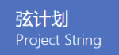

<center></center>

# String-project 「弦计划」 官方小程序

> Author：（排名不分先后）
> 
| 成员&nbsp;       | 个人简介            |
|----------------|-----------------|
| Jun Xia        | 弦计划成员，上海交通大学研究生 |
| Jinghong Zheng | 弦计划成员，华中科技大学本科生 |
| Zhihao Zhang   | 弦计划成员，同济大学研究生   |
| Xinjie Sun     | 弦计划成员，浙江大学CS本科生 |
| Tianxin Zheng  | 弦计划成员，浙江大学本科生   |
| Tianyu Li      | 弦计划成员，中国人民大学本科生 |
| Jingyan Shen   | 弦计划成员，清华大学研究生   |
| Wanfang Hou    | 弦计划成员，南京大学本科生   |

## 项目运行

本项目采用小程序云开发实现。云开发与appid关联，所以请先填入自己的appid

```
// 在project.config.json修改

// ...
"appid": "输入自己的appid",
// ...
```

第二步，创建集合


| 集合名 | 集合权限设置 |
| --- | --- |
| Applied | 所有用户可读，仅创建者可读写 |
| Applying | 所有用户可读，仅创建者可读写 |
| Info | 所有用户可读，仅创建者可读写 |
| Major | 所有用户可读，仅创建者可读写 |
| User | 所有用户可读，仅创建者可读写 |


## 项目名称

Project String


***

## 项目介绍

> to be done

***

## 功能介绍

### 搜索

### 广场

### 信息查看

### 设置

* UI设置

***


## 详细功能介绍

> to be done


